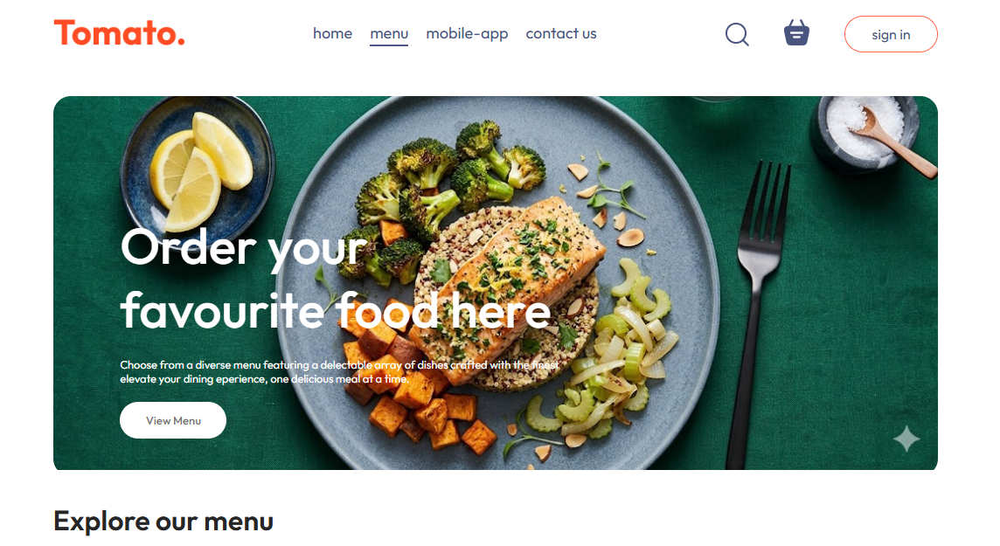
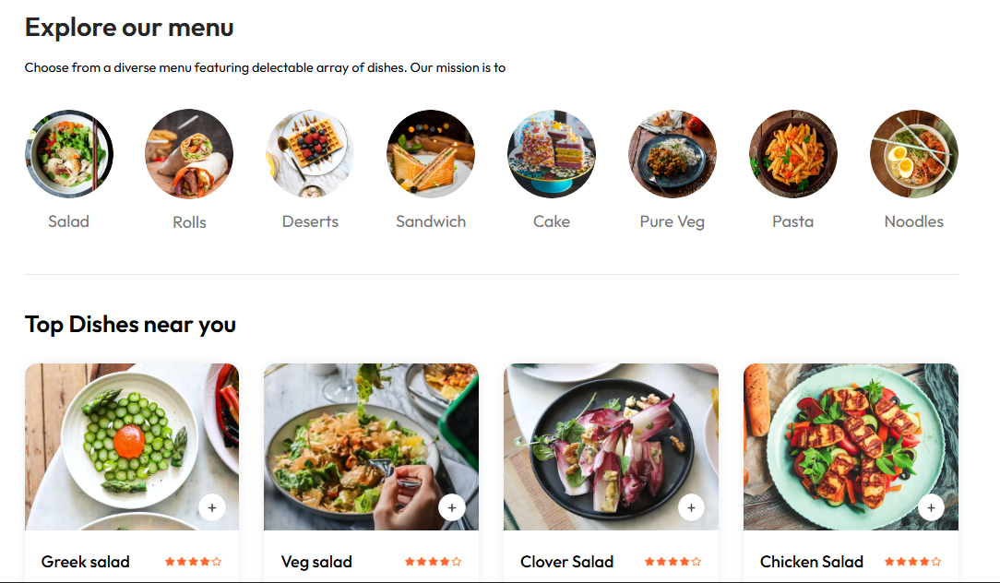
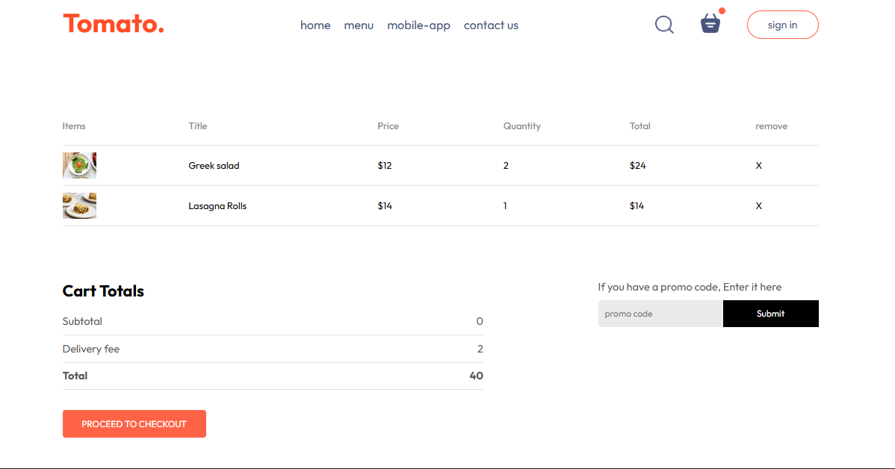
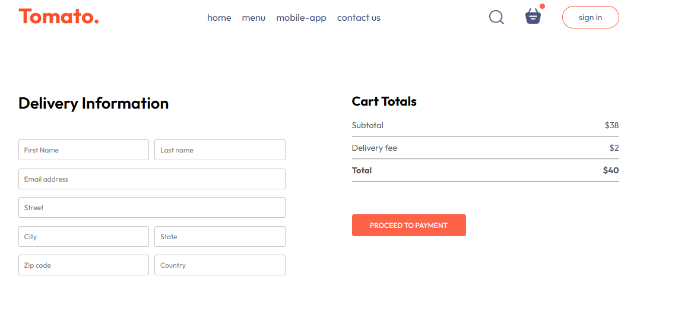
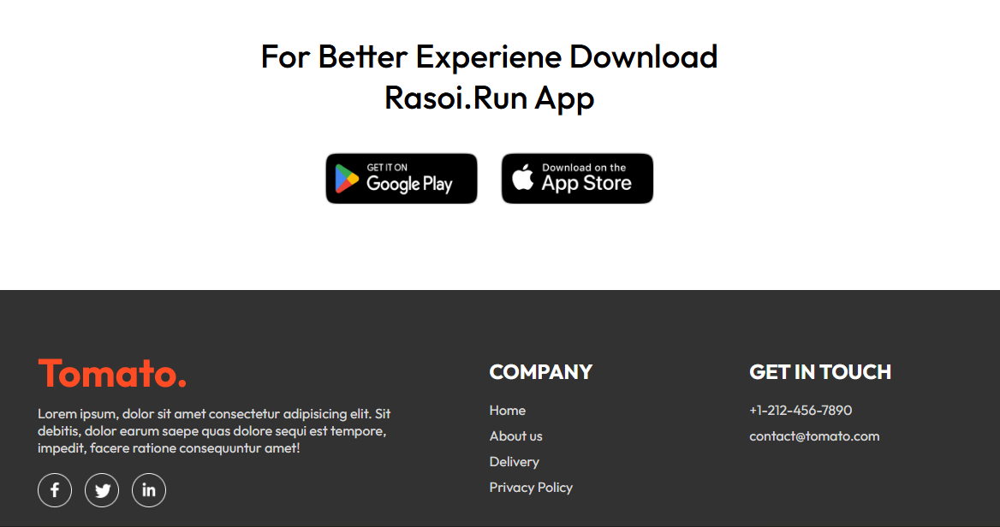

# 🍽️ Rasoi.Run – Your Local Food Delivery Partner

A modern **society-only food delivery web application** designed to provide a fast, smooth, and reliable food ordering experience. Users can explore menus, add items to cart, place orders, and complete secure checkout — all within a clean and responsive interface.

---

## 🚀 Live Demo
🔗 Add your deployed link here

## 📂 GitHub Repository
🔗 Add your repository link here

---

## ✨ Features

✅ **Responsive Design**  
Optimized for desktop, tablet, and mobile devices.

✅ **Modern UI/UX**  
Clean, user-friendly interface for effortless navigation.

✅ **Food Categories & Menu Browsing**  
Browse meals through organized categories.

✅ **Shopping Cart System**  
Add/remove items, update quantity, and view total price.

✅ **Secure Checkout**  
Simple checkout form with delivery details.

✅ **Fast Performance**  
Built with React + Vite for blazing-fast loading.

✅ **Footer with App Promotion**  
Promotes mobile application and provides useful links.

---

# 📸 Screenshots

## 🏠 Home Page


---

## 🍔 Food Categories


---

## 🛒 Shopping Cart


---

## 💳 Checkout Page


---

## 📱 Footer Section


---

# 🛠️ Tech Stack

| Technology | Usage |
|------------|-------|
| HTML5 | Structure |
| CSS3 | Styling |
| JavaScript | Logic |
| React.js | Frontend UI |
| Vite | Fast Build Tool |

---

# 📂 Folder Structure

```bash
Rasoi.Run/
│── public/
│── src/
│   ├── components/
│   ├── pages/
│   ├── assets/
│── screenshots/
│── package.json
│── README.md